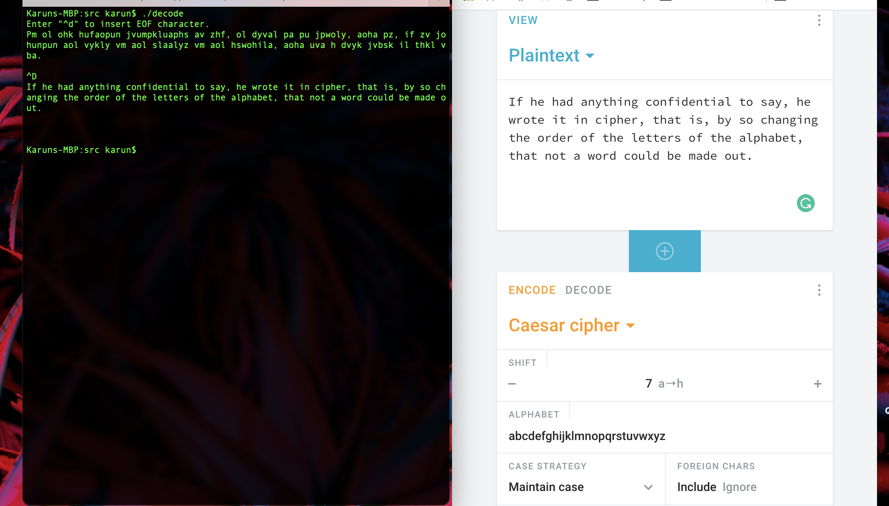

<!-- PROJECT Title -->
# Caesar Cipher Decoder

<!-- ABOUT THE PROJECT -->
## About The Project

This is an academic project designed to decode caesar cipher encrypted messages.

# Screenshots


### Compile
 
```sh
cd src
make all
```

### Q1

Usage: ./frequency_table -F inputFile.txt

Arguments:
	-F: 
		- The name of the input file.
		- If missing use stdin (to end the input, press ^d on the keyboard, which inserts the EOF character).


This program reads in an input file or STDIN and prints a frequency table to stdout along with the following details:
	- the number of letters in the text
	- the total number of characters in the text

### Q2

Usage: ./decode -stx –F myfile.txt –O decodedfile.txt

Arguments:
	-F: 
		- The name of the input file.
		- If missing use stdin (to end the input, press ^d on the keyboard, which inserts the EOF character).
	-O:
		- The name of the output file after decoding.
		- If missing use stdout, where the decoded text should be the last thing printed.
	-n:
		- Suppresses the printing of the decoded file to stdout. Useful in combination with -s or –S. 
		- If -O is included as a command line argument -n does nothing.
	-s:
		- Computes the Caesar shift value used to decode the message, and prints it to stdout (e.g. shift = 4). 
	-S:
		- Computes the original Caesar shift value used to encode the message, and prints it to stdout (e.g. shift = 4). 
	-t:
		- Computes the character/letter count summary and frequency table and prints them to stdout using the same format at question 1.
	-x: 
		- Computes the chi squared value for all shifts, printing them out along with their corresponding shift values

This program computes the frequencies found in the input file, and uses the Chi-Squared formula to solve the shift that was used to encode text. The program will then take this shift and decode the text to an output file or STDOUT.

### Q3

Usage: ./copyrecords –F myfile.txt –O decodedfile.txt -D cipher.txt

Arguments:
	-F: 
		- The name of the input file.
		- If missing use stdin (to end the input, press ^d on the keyboard, which inserts the EOF character).
	-O:
		- The name of the output file after decoding.
		- If missing use stdout, where the decoded text should be the last thing printed.
	-D:
		- The name of the text file to be used to find the Caesar cipher shift to be used to decode the text fields of each record.
		- If missing, the text fields are left undecoded when copied.
	-r:
		- Copy the records in reverse order. 
		- If missing, the records are copied in order.

This program reads in a file that contains a series of records written in binary mode. If a text field is encrypted, it is using a Caesar cipher encryption with the same shift as used in encoding a companion file stored in the same directory, which hold English text that contains at least 100 characters.

The program will copy the records across to a new file (in binary format), possibly in reverse order, with the fields decoded using the shift discovered using the accompanying text file.

